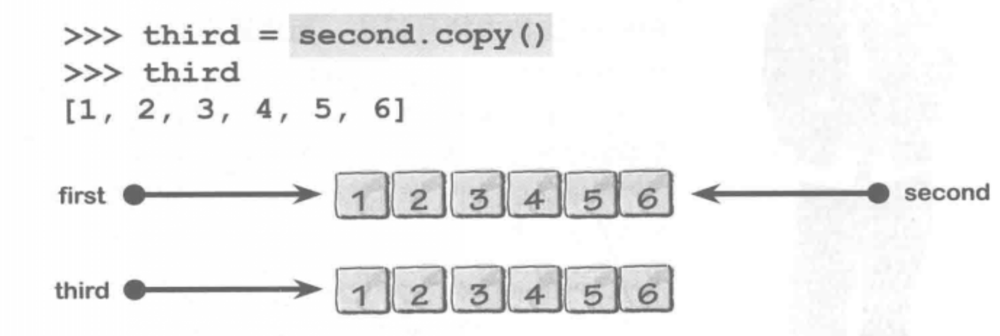

1.python中数字、字符串、函数、模块所有一切都是对象，而且所有对象都可以动态赋给任何变量

2.列表【list】：有序的可变对象集合。异构的，可以保持不同类型对象

3.元组：有序的不可变对象集合。可以把元组想成是一个常量列表

4.字典：无序的键/值对集合

5.集合：无序的唯一对象集合

6.列表操作

1.创建一个列表：found=[ ], found=[1,3,4,5] found=[1,’way’,[1,2,4],88]

2.常用方法：
    append：添加一个元素到列表结尾：found.append(1)
    remove（取一个对象值作为唯一参数）：从列表中删除指定数据值的第一次出现，如果没有找到会产生错误。
    found.remove(3) //删除第一次出现的值’3’。不是索引值

​	pop（取一个可选的索引值作为参数）：如果不指定将删除并返回最后一个，如果列表为空或者指定不存在的索引，解释器会产生一个错误。

​	extend（取一个对象列表作为唯一参数）：将接收端列表中各个对象添加到现有列表（末尾）

​	insert（取一个索引值和一个对象作为参数）：将一个对象插入到现有列表中指定索引值前面。
 	   found.insert(2,’jack’) //第一个为索引，第二个为要插入的值
​	（索引操作最大值添加到末尾，小于等于0添加到最前）

copy：复制一份新数据

​    3.列表文档查看：
​        help(list)可以访问列表中的文档 help(list.insert)查看列表insert方法的文档

​    4.python支持中括号记法，而且支持负索引值。（正索引值从左向右0开始，负索引从右向左-1开始）。同时支持start（开始值[包括]：默认值0）、stop（结束值[不包括]：列表允许的最大值）和step（步长值，默认值1）
​    found[0]、found[-1]、found[-2]、found[0:10:3]、found[3:]、found[:10]、found[ : : 2 ]

